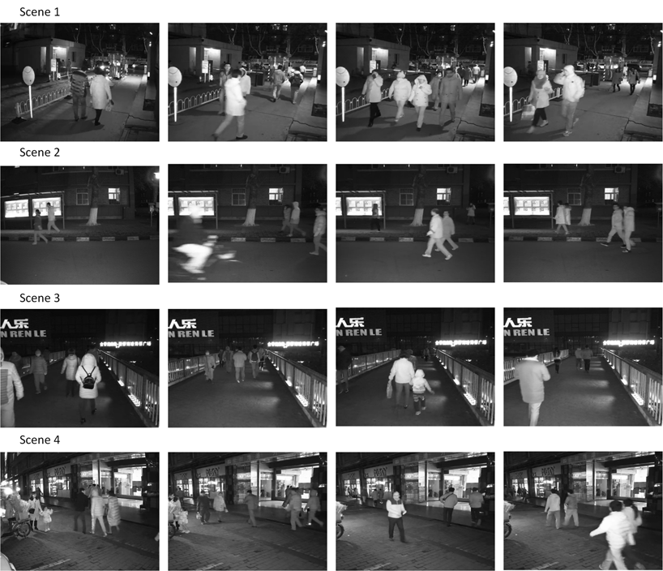

## Abstract

Pedestrian detection is among the most frequently-used preprocessing tasks in many surveillance application fields, from low level people counting to high level scene understanding. Even though many approaches perform well in the daytime with sufficient illumination, pedestrian detection at night is still a critical and challenging problem for video surveillance systems. To respond to this need, in this paper, we provide an affordable solution with a near-infrared stereo network camera, as well as a novel three-dimensional foreground pedestrian detection model. Specifically, instead of using an expensive thermal camera, we build a near-infrared stereo vision system with two calibrated network cameras and near-infrared lamps. The core of the system is a novel three-dimensional cube surface model, which is able to estimate the dynamic changes of three-dimensional geometric information of the surveillance scene and to segment and locate foreground pedestrians in real time. A free update policy for unknown points is designed for model updating, and the extracted shadow of the pedestrian is adopted to remove foreground false alarms. To evaluate the performance of the proposed model, the system is deployed in several nighttime surveillance scenes. Experimental results demonstrate that our method is capable of segmenting and detecting nighttime pedestrian in real time under heavy occlusion. In addition, the qualitative and quantitative comparison results show that our work outperforms classical background subtraction approaches and a recent RGB-D method, as well as it achieves comparable performance with the state-of-the-art deep learning pedestrian detection method even with a much lower hardware cost.

## Dataset

Dataset can be downloaded [here](https://pan.baidu.com/s/1mhLMIoS). Total in size = 2.14G. Data was caputred 29frames/s, and the resolution of each frame is 640*480. Each frame has been calibrated, can be directly done binocular stereo matching.

## Demo

Demo video for Nighttime Foreground Pedestrian Detection based on Three-dimensional Cube Surface Model can be download [here](https://pan.baidu.com/s/1mhLMIoS).

## Reference

1. Jing, L.; Fangbing, Z.; Lisong, W.; Tao, Y. Nighttime Foreground Pedestrian Detection based on Three-dimensional Voxel Surface Model. 
Sensors, 2017.
